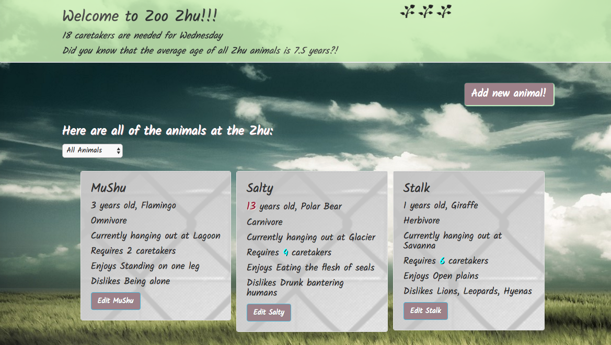

# Zoo Zhu

_Angular JS Independent Project for Epicodus, 08.18.2017_

By _Calla Rudolph_ [e-mail me](<mailto:callarudolph@gmail.com>)

## Description

This Angular 2 app was created to track zoo animals. It displays a list of all animals with their species, name, age, diet, location, caretakers, sex, likes, and dislikes. The user can add new animals and edit existing animals. Animals may be sorted by age level (baby or mature). The app displays the total number of caretakers needed for the zoo, the current day of the week, and the average age of all zoo animals. These features automatically update when a new animal is added or a current animal is edited.

The purpose of this project was to utilize models, components, and pipes with one and two-way event and property bindings. This version does not utilize a database.

_***Take a look at planning.md to see the foundation for this app!***_

_This image is a screenshot of the splash page_

_This project was generated with [Angular CLI](https://github.com/angular/angular-cli) version 1.0.0._

## Prerequisites

You will need the following things properly installed on your computer:
* [Git](https://git-scm.com/)
* [Node.js](https://nodejs.org/) (with NPM)
* [Angular](https://cli.angular.io/) (in Terminal: $ npm install -g @angular/cli@1.0.0)
* [TypeScript](https://www.typescriptlang.org/) (from NPM in Terminal: $ npm install typescript -g)
* [Bower](https://bower.io/)

## Installation

* Open Github site in your browser: https://github.com/CallaRudolph/angular-zoo
* Select green drop-down box to Clone or Download
* Open Terminal on your computer and follow these steps:
  * `$ cd desktop`
  * `$ git clone <paste repository-url>`
  * `$ cd angular-zoo`
  * `$ npm install`
  * `$ bower install`
  * `$ ng build`

## Development server

Run `ng serve` for a dev server. Navigate to `http://localhost:4200/`. The app will automatically reload if you change any of the source files.

## Future Functionality

* Implement auto-adjust for number of caretakers and average animal age if an animal is edited or a new animal is added
* Add property to record when each animal is admitted, using a timestamp
* Add additional pipe to show animals based on diet type
* Include Firebase to store animals
* Hide 'add new animal' button upon click
* Add form validation for editing and entering new animals to avoid empty string inputs

## Technologies Used

Angular 2 JavaScript, TypeScript, Node.js, Bootsrap, CSS, HTML

## License

Copyright &copy; 2017 Calla Rudolph

_Please email me at the above address with any comments or improvements you have found!_

This software is licensed under the MIT license.
______________________________________

## Code scaffolding

Run `ng generate component component-name` to generate a new component. You can also use `ng generate directive/pipe/service/class/module`.

## Build

Run `ng build` to build the project. The build artifacts will be stored in the `dist/` directory. Use the `-prod` flag for a production build.

## Running unit tests

Run `ng test` to execute the unit tests via [Karma](https://karma-runner.github.io).

## Running end-to-end tests

Run `ng e2e` to execute the end-to-end tests via [Protractor](http://www.protractortest.org/).
Before running the tests make sure you are serving the app via `ng serve`.

## Further help

To get more help on the Angular CLI use `ng help` or go check out the [Angular CLI README](https://github.com/angular/angular-cli/blob/master/README.md).
